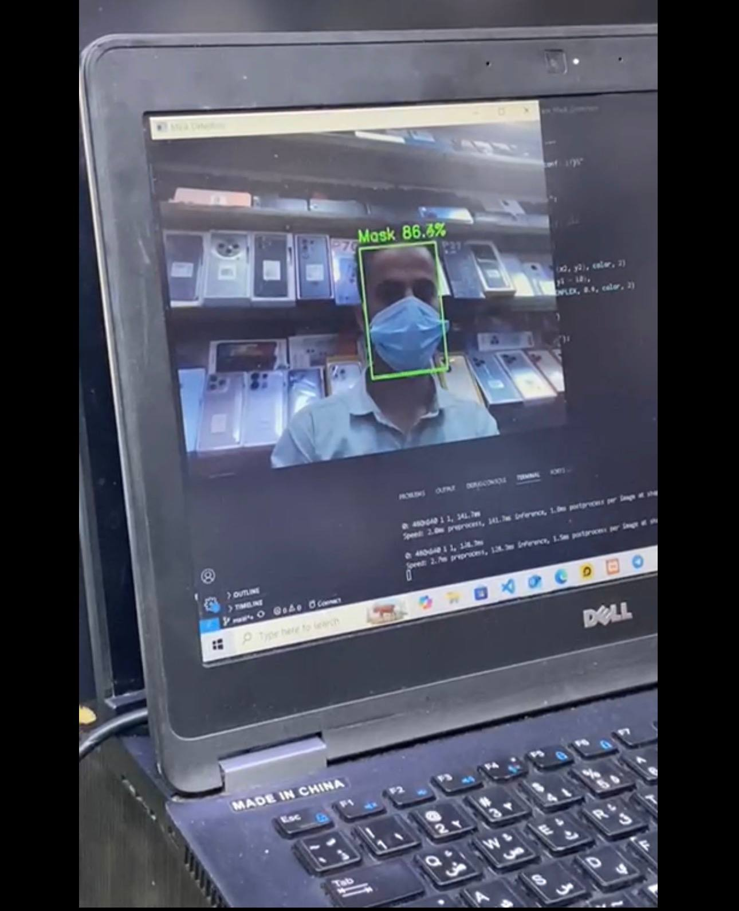

# Real-Time Face Mask Detection using YOLO

A computer vision project that detects whether people are wearing face masks using the YOLO object detection model.

The system supports two modes:

- Image detection through Hugging Face interface.
- Real-time detection using a laptop webcam.

When a person without a mask is detected, the system captures an image, records the detection time, and sends an email alert with the captured image to the responsible person.

## Technologies

Python • YOLO • OpenCV • Computer Vision • Deep Learning • Hugging Face • SMTP


## Screenshots

<table>
  <tr>
    <td align="center">
      <b>Hugging Face Image Detection</b><br>
      
    </td>
    <td align="center">
      <b>Real-Time Webcam Detection</b><br>
      
    </td>
    <td align="center">
      <b>Email Alert Notification</b><br>
      
    </td>
  </tr>
</table>


## Project Structure

```
Face-Mask-Detection-YOLO/

│
├── app.py
├── best.pt
├── requirements.txt
│
├── huggingface/
│   ├── app.py
│   ├── best.pt
│   └── requirements.txt
│
├── screenshots/
│   ├── huggingface-test.png
│   ├── live_test.jpg
│   └── email-alert.png
│
└── README.md
```


## Features

- Real-time face mask detection using YOLO.
- Webcam-based live monitoring.
- Image detection through Hugging Face application.
- Automatic capture when a person without a mask is detected.
- Detection time logging.
- Email notification with captured image attachment.


## Author

Anas Al-Awadhi
